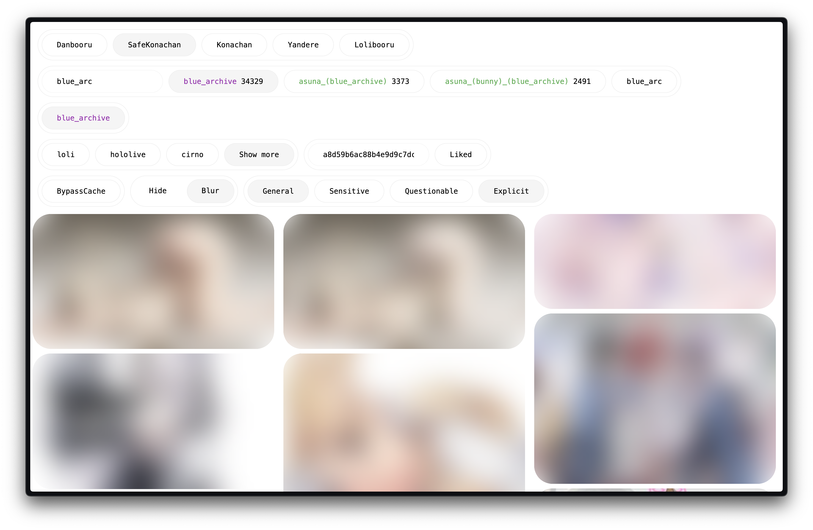

# About

[Danbooru](https://danbooru.donmai.us/)のクライアントです。
Danbooruの他にMoebooru等も対応していますが Gelbooruには対応していません

## Futures
- 一般的な機能
- like機能
  - アカウントのid ( uuid ) を共有すればlikeした画像を簡単に共有できる
- blur機能
  - ratingがeやqの投稿 ( NSFW ) にblurをかけたり、非表示にする機能
- tag検索
  - 高速なauto completeがあるのでうろ覚えでも検索可能
  - 一部のtagは日本語で検索可能


# How to use `Boorutan`
現在[booru.i32.jp](https://booru.i32.jp)にデプロイされていますが
サーバーの性能、帯域幅共に悪く、不安定なためセルフホストすることをお勧めします

# How to run `Boorutan`
```bash
$ npm i
$ npm run dev
```
上記のコマンドで実行できます
デフォルトではbackendのサーバーとして、[api-booru.i32.jp](https://api-booru.i32.jp)が使用されます。
これは`lib/url.ts`を変更することによって変えられます

backendのリポジトリは[boorutan-backend](https://github.com/boorutan/boorutan-backend)です